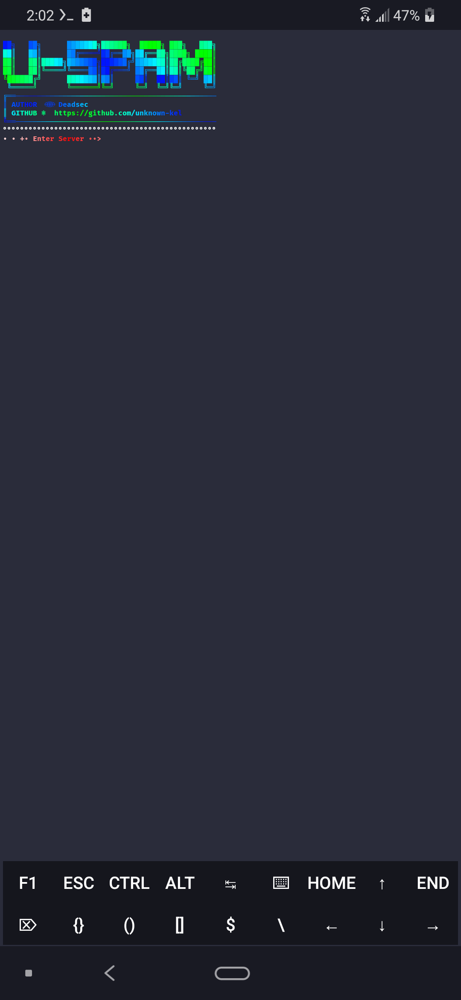

# U-Spam

### [+] Created By <a href="https://github.com/unknown-kel">unknown-kel</a>

### [+]Tool  Decription :
***Mass Mail Sender***
***With Custom Smtp Sever***

### [+] Installation

```apt install git python -y```

```git clone https://github.com/unknown-kel/u-spam```

```cd u-spam```
 
```python spam.py```


### Or, Use Single Command
```
apt install git python -y && git clone https://github.com/unknown-kel/u-spam && cd u-spam &&
python spam.py
```

## Screenshots:




